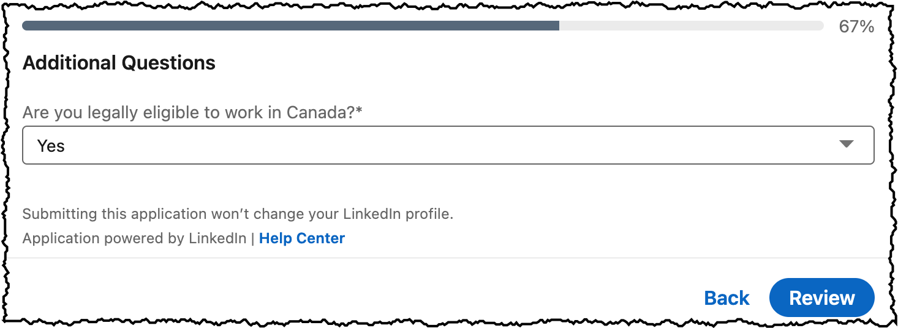
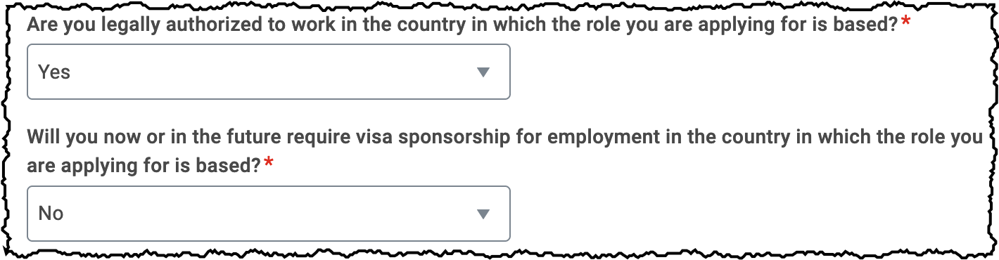

I'm happy with my current employer, but next time it comes to looking for work as a technical writer, I intend to remember that not all companies are created equal. Some companies signal to prospective employees how they can expect to be treated. Unsurprisingly, especially to adherants of [Sturgeon's law](https://en.wikipedia.org/wiki/Sturgeon%27s_law), more companies will signal that they will _not_ treat you well, but do not despair. There are still companies that signal the significant respect that they have for their employees and prospective employees. Profitable and respected companies, capitalism apologists please note.

Most companies looking to hire technical writers demand attention to detail in their products to deliver a great experience for their customers. Any company that clearly does not hold themselves to that standard when dealing with their prospective employees is an employer best avoided. Any person or company willing to grant themselves an exemption from their own requirements is one to approach only when necessary, and even then with caution.

A major high-tech firm well known to developers posted a job located in Canada that required applicants to select from a list of American states (!), and did not provide a way to change the country from the US to Canada. I'm well used to forms that default to requiring selecting a state, but the majority of forms change the list from states to provinces once you select Canada as the country. That wasn't the case here.

What's more, the same employer, on the same form, appeared to offer applicants a choice of uploading a writing sample, or providing a URL to a portfolio... and then made it mandatory to upload a file even if you provided the portfolio URL.

This slipshod interface gives the impression that the hiring form was rushed out, between "important" work, over someone's lunch hour.

And if the company outsourced the hiring process&mdash;that's worse! They cheaped out or, for some other less-savoury reason, hired a supposed expert in hiring that takes the process lightly in their quest for quantity over quality.

But that was a one-off. Much more common are employers who are looking for a Canadian employee and ask applicants to declare whether they need sponsorship to work in the United States. How is one meant to respond?

Also, I take just a moment to celebrate whenever an employer uses a form that asks whether I am eligible to work in Canada. These are the employers I strive to remember.

Even an employer that outsources its hiring to a firm that knows the minor differences in global hiring deserves recognition at least, and I like to think that praise is due such employers as well.

Compare this barely-customized boilerplate approach to the wonderful hiring process of GitLab. They are absolutely the gold standard for hiring technical writers. Every part of [their hiring process is documented](https://about.gitlab.com/handbook/hiring/interviewing/#how-we-conduct-remote-interviews-on-a-global-scale) and available for any applicant or even prospective applicant to view. Even salary ranges and benefits are available for an applicant who has been granted a screening interview.

I've been a much happier person since I realized that you should give more weight to how people treat you than what they tell you. The majority of people will tell you, through their actions, exactly what their priorities are. It's up to all of us to pay attention to those signals.